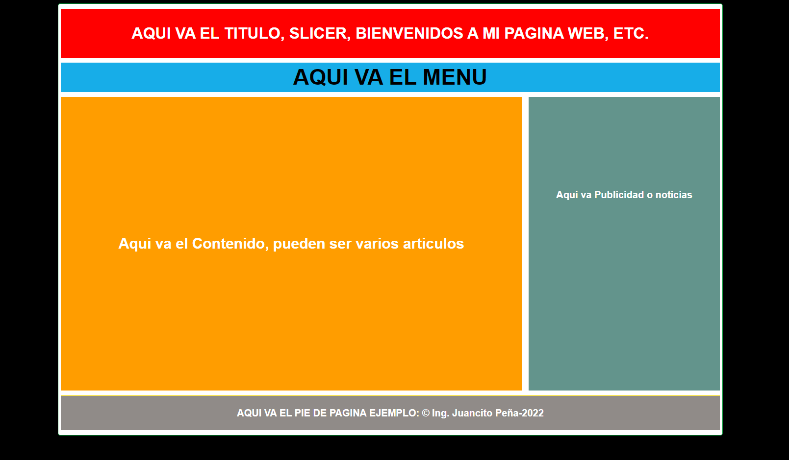

# PROYECTO ESTRUCTURA BÁSICA HTML Y CSS

Este proyecto es una maqueta básica de un sitio web sin capacidad de respuesta, diseñado utilizando elementos semánticos de HTML como `header`, `nav`, `article`, `aside`, y `footer`. También incluye un archivo CSS para darle estilo a la página.

## Contenido del Proyecto

- **index.html**: Archivo HTML principal que representa la estructura básica de la página web.
- **style.css**: Archivo CSS para estilizar la página HTML.
- **logo-html.png**: Imagen del logotipo del proyecto.

## Estructura del Sitio

El proyecto utiliza elementos semánticos de HTML para organizar el contenido:

- El `<header>` contiene la cabecera de la página.
- La etiqueta `<nav>` representa la barra de navegación.
- El contenido principal se encuentra dentro de un `<article>`.
- El `<aside>` se utiliza para contenido relacionado o secundario.
- El `<footer>` contiene el pie de página.

# CAPTURAS DE PANTALLA:



## Cómo Usar

1. Clona este repositorio en tu máquina local:

```bash
git clone https://github.com/tuusuario/PROYECTOESTRUCTURABASICAHTMLYCSS.git
